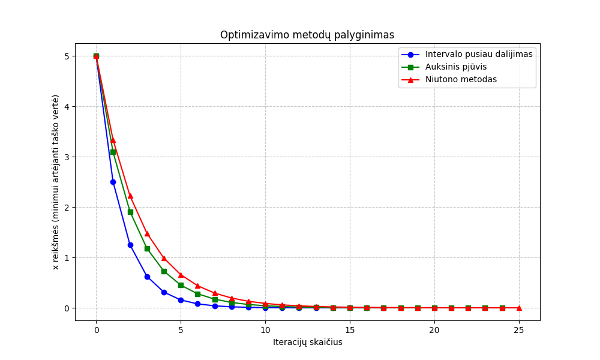
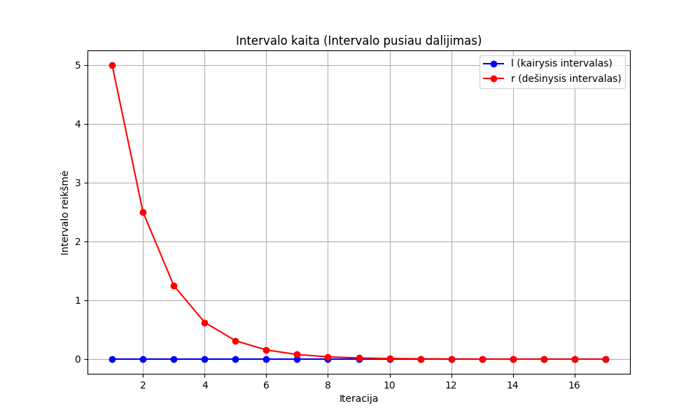
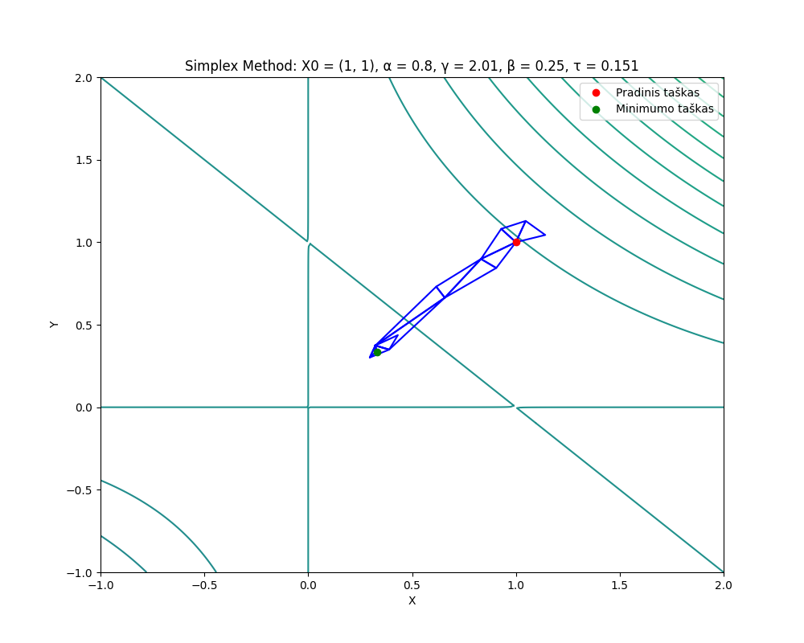
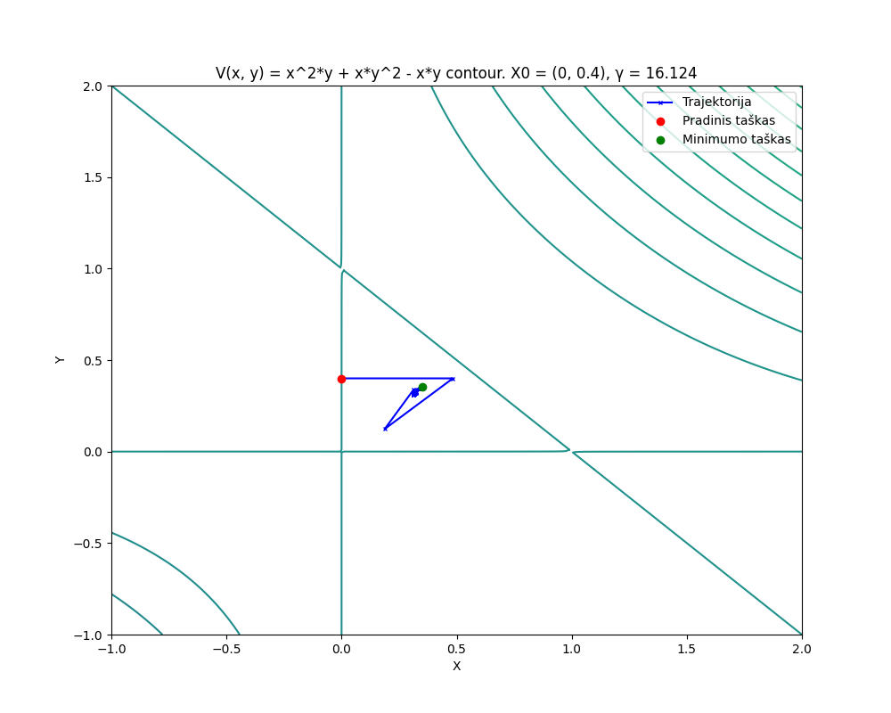
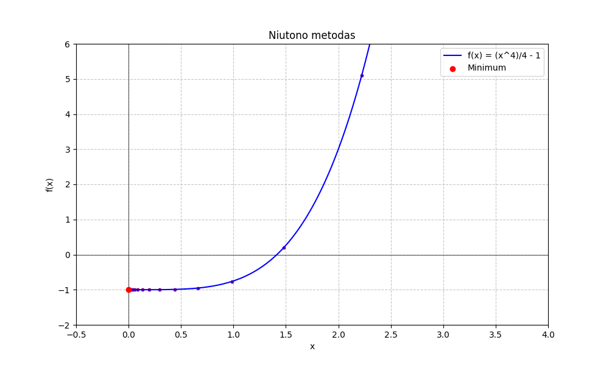
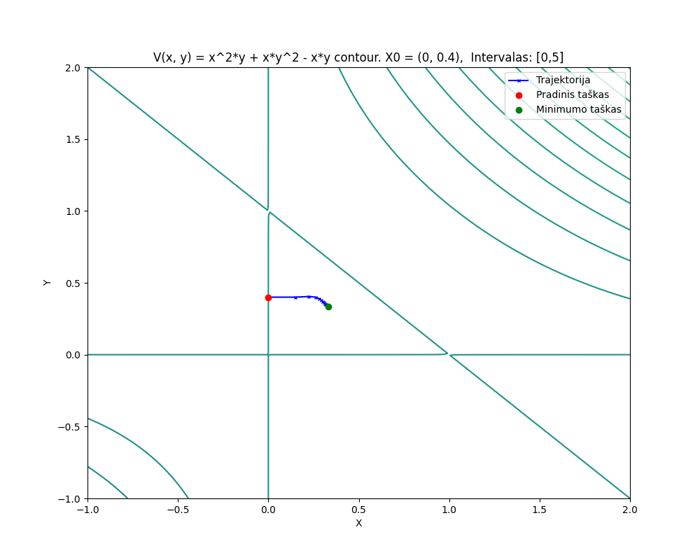

# Optimization Methods

Numerical optimization coursework from Vilnius University, Faculty of Mathematics and Informatics. Four Python labs cover one-dimensional search, multivariable gradient and simplex methods, nonlinear constraints, and linear programming.

The collection includes the original implementations, saved convergence plots, and three Lithuanian coursework reports from 2024. Each lab has a mathematical model, runnable entry point, parameter reference and explanation of its output.

| Lab | Methods | Problem | Output |
| --- | --- | --- | --- |
| [One-dimensional optimization](labs/one_dimensional/) | Interval halving, golden-section search, Newton's method | Minimize a quartic function on a bounded interval | Iteration tables and eight figures |
| [Unconstrained optimization](labs/unconstrained/) | Fixed-step gradient descent, bounded line search, deformable simplex | Compare local search trajectories for a box-volume model | Iteration tables and three contour figures |
| [Nonlinear constrained optimization](labs/constrained/) | Quadratic penalty and a three-dimensional deformable simplex | Maximize box volume with fixed surface area | Penalty iterations and final coordinates |
| [Linear programming](labs/linear/) | Tableau simplex with slack variables | Minimize a linear objective under inequality constraints | Pivot operations, tableaux and final solution |

[Getting started](#getting-started) · [Mathematical models](#mathematical-models) · [Original figures](#original-figures) · [Reports](#reports-and-recorded-results)

## Getting started

### Requirements

- Python 3 with `venv` and `pip`.
- NumPy, pandas and Matplotlib, listed in [requirements.txt](requirements.txt).
- A desktop session with a working Matplotlib graphical backend for the first two labs.

The constrained lab uses only the Python standard library. The linear-programming lab requires NumPy. Installing the full requirements file prepares the environment for all four labs.

```sh
git clone https://github.com/lukamaga/optimization-methods.git
cd optimization-methods

python3 -m venv .venv
source .venv/bin/activate
python -m pip install -r requirements.txt
```

On Windows, create the environment with `py -m venv .venv` and activate it in PowerShell with `.venv\Scripts\Activate.ps1`.

### Run a lab

Run one of these commands from the repository root with the environment active:

```sh
python labs/one_dimensional/main.py
python labs/unconstrained/main.py
python labs/constrained/main.py
python labs/linear/main.py
```

The first two programs open figures sequentially. Close each figure window to advance. The one-dimensional program prints its tables after the figures; the unconstrained program prints its tables before them. The other two programs use the console only.

The scripts use parameters defined in the source and do not accept command-line options. They display results without automatically exporting new plots or tables. The images and reports under `docs/` are saved coursework material.

## Mathematical models

### 1. One-dimensional search

The three methods solve the same problem:

$$
\min_{x\in[0,10]} f(x),\qquad f(x)=\frac{x^4}{4}-1.
$$

Interval halving and golden-section search reduce a bracket using function values. Newton's method uses the derivatives $f'(x)=x^3$ and $f''(x)=3x^2$, starting from $x_0=5$. For this objective, a nonzero Newton iterate satisfies $x_{k+1}=2x_k/3$.

The supplied tolerance is $10^{-4}$. The analytical solution is $x^*=0$, with $f(x^*)=-1$. The saved figures show search points, interval boundaries and Newton iterates.

[Model, parameters and iteration output](labs/one_dimensional/README.md)

### 2. Unconstrained local optimization

Three methods are compared on

$$
f(x,y)=\frac{x^2y+xy^2-xy}{8}.
$$

The box interpretation uses the areas of opposite face pairs: $x=2ac$, $y=2bc$ and $z=2ab$. With total surface area one, $z=1-x-y$ and the squared volume is

$$
V^2=\frac{xyz}{8}=\frac{xy(1-x-y)}8=-f(x,y).
$$

The physical region is $x\ge0$, $y\ge0$, $x+y\le1$. The algorithms in this lab operate without constraints, so their trajectories can leave that region. The point $(1/3,1/3)$ is a local minimum of $f$, with value $-1/216$; the objective is unbounded below on the full plane.

The active experiment starts at $(0,0.4)$ and uses a tolerance of $10^{-4}$:

- Fixed-step gradient descent uses $\gamma=0.03$.
- The line-search variant chooses a step in $[0,1]$ using a golden-section-style search.
- The deformable simplex evolves three vertices through reflection, expansion, contraction and shrinking.

The contour plots make the effect of the starting point and step choice visible. The report also compares additional starts and parameter settings.

[Gradient formulas, coefficients and stopping conditions](labs/unconstrained/README.md)

### 3. Nonlinear constraints through a penalty

Here the variables are the box's side lengths, rather than face-pair areas. The problem is

$$
\min_{x,y,z\ge0} -xyz
\quad\text{subject to}\quad
2xy+2xz+2yz=1.
$$

The implementation minimizes the augmented objective

$$
B(X,r)=-xyz+\frac1r\left[
\max(0,-x)^2+\max(0,-y)^2+\max(0,-z)^2+
(2xy+2xz+2yz-1)^2
\right].
$$

A three-dimensional deformable simplex solves each augmented problem. The penalty parameter starts at $r=10$ and is halved between solves, increasing the cost of constraint violations. The supplied starting point is $(0.1,0,0.4)$.

The analytical optimum is a cube:

$$
x=y=z=\frac1{\sqrt6},\qquad V_{\max}=\frac1{6\sqrt6}\approx0.06804138.
$$

The source names its objective `V`, but prints the negative volume because it solves a minimization problem. The active outer stopping rule uses changes in the stored penalty and coordinate signs; it is not a direct feasibility tolerance.

[Penalty schedule, simplex parameters and output interpretation](labs/constrained/README.md)

### 4. Linear programming with a tableau

The active example minimizes $-2x_1-3x_2-5x_4$ subject to

$$
\begin{aligned}
3x_1+x_2-x_3-x_4 &\le8,\\
-2x_1+4x_2 &\le10,\\
x_3+x_4 &\le3,\\
x_1,x_2,x_3,x_4 &\ge0.
\end{aligned}
$$

Slack variables provide the initial feasible basis. The implementation selects an entering column, applies the minimum-ratio test and performs row operations. The printed tableaux expose each pivot.

The analytical reference solution is $(17/7,26/7,0,3)$, with objective value $-31$. The stored solution vector, `model.x`, also includes the three slack variables. This is an educational tableau implementation for problems with a feasible initial slack basis.

The tableau simplex method is distinct from the geometric deformable-simplex methods used in the nonlinear labs.

[Coefficient matrices, tableau operations and solver scope](labs/linear/README.md)

## Original figures

The 23 saved figures illustrate interval reduction, search trajectories and changing simplex geometry. Original Lithuanian labels are retained. The [figure gallery](docs/results/gallery.md) includes the complete selected set with descriptions and source mappings.

### Comparing one-dimensional methods



Extracted from the original report, this chart compares the recorded search points by iteration. The methods use different stopping criteria and perform different work per iteration, so the trajectories alone do not measure computational cost.

### Reducing a search interval



For the quartic objective, the minimum lies at the interval's left endpoint. The retained right boundary halves toward zero. The plotted history begins after the first reduction from the initial interval.

### Moving and shrinking a simplex



This saved experiment starts at $(1,1)$. The triangles show the simplex moving toward the local minimum near $(1/3,1/3)$ and contracting as the search progresses. The default source starts at $(0,0.4)$; the report contains both experiments.

### The effect of a gradient step



The larger historical step $\gamma=16.124$ produces a visible change in direction. Although the final plotted point is near the local minimum, the report records that this experiment reached the 10,000-iteration limit. The supplied script's default is $\gamma=0.03$. The original title displays the cubic polynomial without its constant factor $1/8$.

<details>
<summary>Newton's trajectory and a bounded line-search experiment</summary>

### Newton's trajectory



The marked iterates approach the minimum along the quartic curve. The figure's visible horizontal range shows only part of the trajectory from the supplied initial point.

### Bounded line search



This historical experiment searches for a step in $[0,5]$, compared with $[0,1]$ in the active source defaults. Other starts, fixed steps, line-search ranges and interval-search figures are included in the [complete gallery](docs/results/gallery.md).

</details>

## Reports and recorded results

| Report | Date | Contents |
| --- | --- | --- |
| [One-dimensional optimization](docs/reports/01-one-dimensional-optimization-report.pdf) | September 2024 | Three search methods, convergence figures, iteration tables and evaluation counts |
| [Unconstrained optimization](docs/reports/02-unconstrained-optimization-report.pdf) | October 2024 | Box-volume formulation, gradient and simplex comparisons, multiple starting points and parameter choices |
| [Nonlinear constrained optimization](docs/reports/03-constrained-optimization-report.pdf) | November 2024 | Surface-area constraint, penalty method, simplex explanation and recorded numerical results |

Reports are in Lithuanian. Student identifiers have been removed from the public copies; mathematical content and recorded results are retained. The original archive does not contain a separate author-owned report or figure set for the selected linear-programming example.

The analytical solutions above are reference values. The reports and saved figures describe historical experiments, whose parameters can differ from the defaults in the preserved source. Evaluation counts follow the original implementations' bookkeeping and should not be read as uniform runtime benchmarks.

[Recorded results and interpretation](docs/results/recorded-results.md) collect the report values with their original settings. [Figure and report provenance](docs/results/provenance.json) maps the published material to its source files.

## Repository structure

```text
labs/
  one_dimensional/        Interval halving, golden section and Newton
  unconstrained/          Gradient methods and a 2D deformable simplex
  constrained/            Quadratic penalty and a 3D deformable simplex
  linear/                 Linear-programming tableau
docs/
  assets/                 Saved coursework figures
  reports/                Three coursework PDF reports
  results/                Figure gallery and historical result notes
requirements.txt          Python dependencies
ATTRIBUTION.md            Source mapping and coursework attribution
```

Each lab has its own README. The six Python source files retain their original contents, including comments, parameters and output labels.

## Author

Lukaš Patrik Magalinski, Vilnius University, Faculty of Mathematics and Informatics. Course: *Optimizavimo metodai*.

See [ATTRIBUTION.md](ATTRIBUTION.md) for the source mapping and notes on course material.
