# Original figure gallery

These figures come from the saved 2024 coursework plots and reports. Lithuanian labels are retained; English captions identify the methods and parameters. PNG exports are copied without changes. The comparison figure is extracted from page 10 of the one-dimensional report.

The two-dimensional contour titles show the polynomial without its factor of 1/8. The report and code use the scaled objective $f(x,y)=(x^2y+xy^2-xy)/8$. This distinction does not change the geometric level sets, but the scale matters when interpreting a fixed gradient step.

## One-dimensional methods

Eight figures: comparison, sample points and interval histories

### Method comparison

### Interval halving: sample points

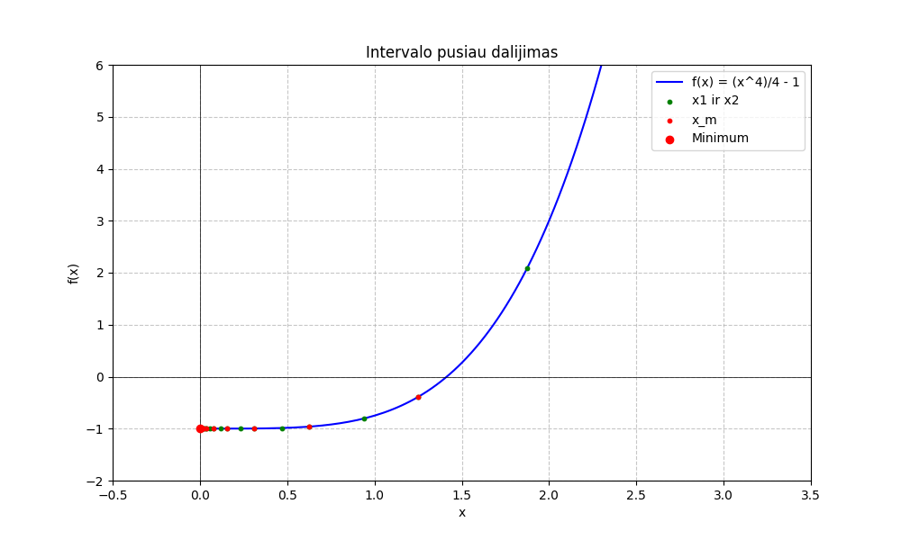

### Interval halving: search intervals

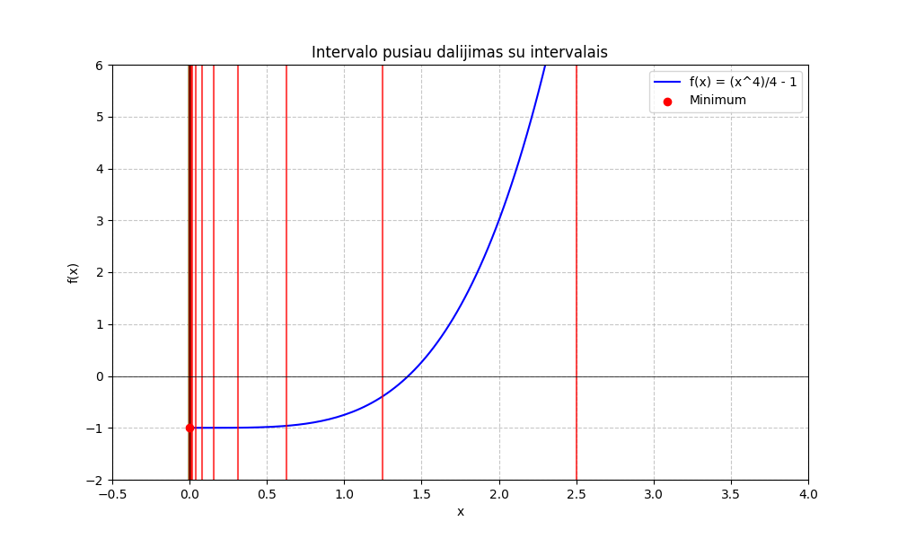

### Interval halving: endpoint history

### Golden section: sample points

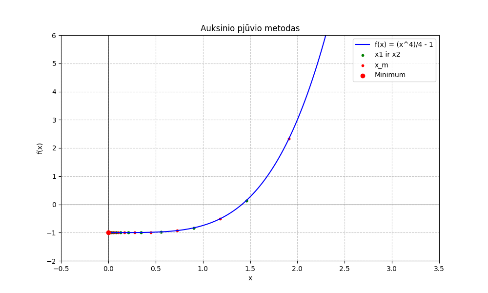

### Golden section: search intervals

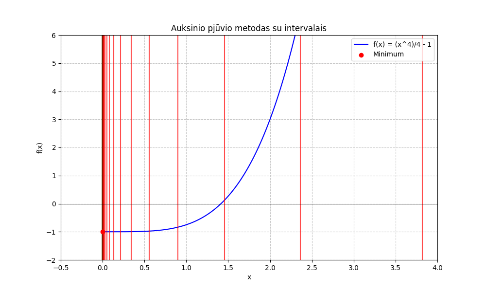

### Golden section: endpoint history

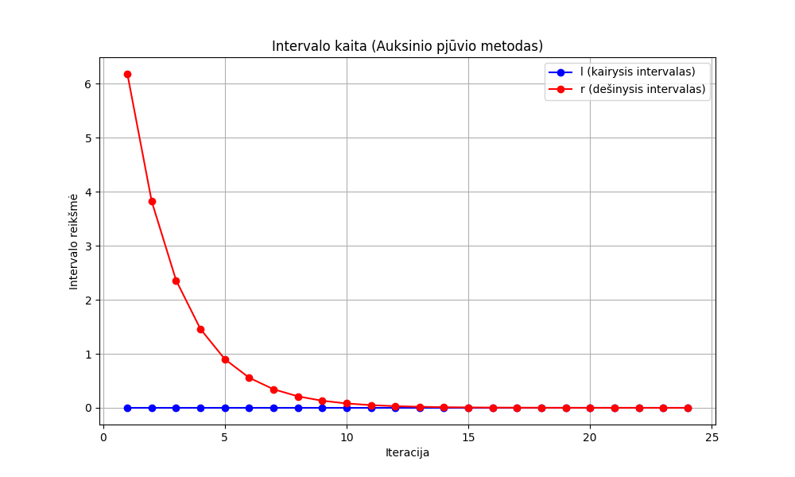

### Newton iterates

## Unconstrained methods

Eight fixed-step gradient experiments

### Step 0.03, start (0, 0.4)

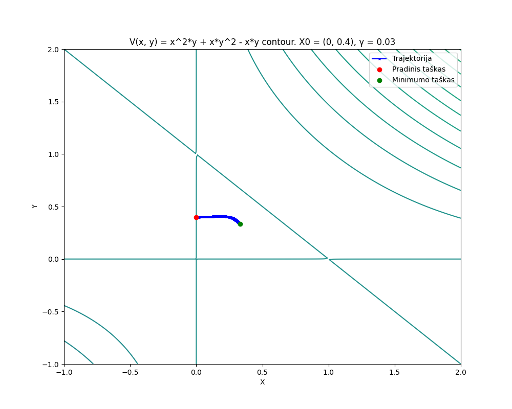

### Step 0.03, start (1, 1)

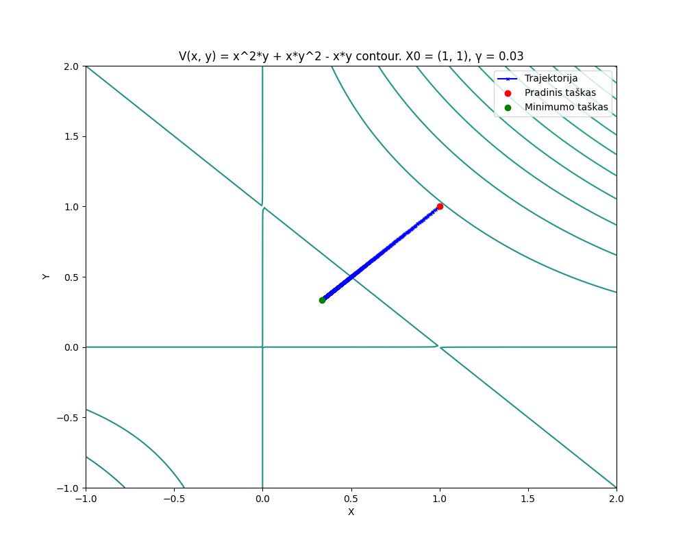

### Step 0.3, start (1, 1)

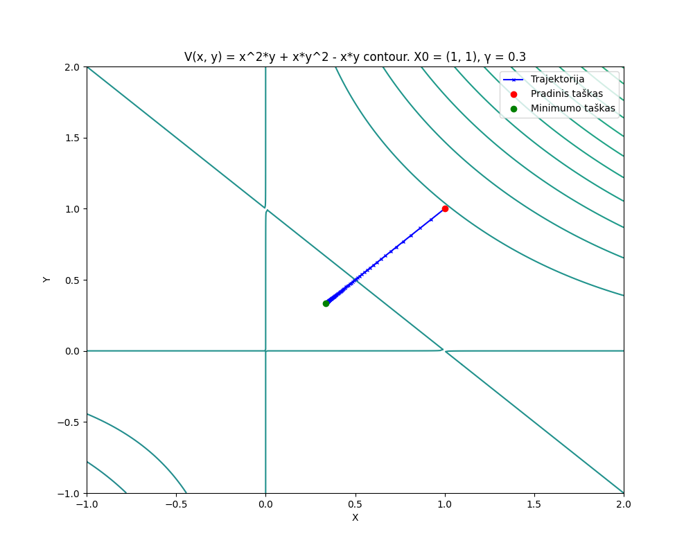

### Step 10.523, start (0, 0.4)

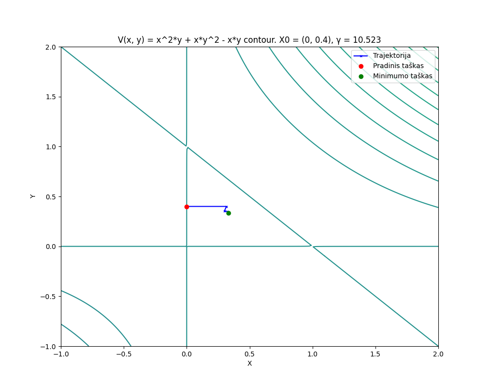

### Step 15.4523, start (0, 0.4)

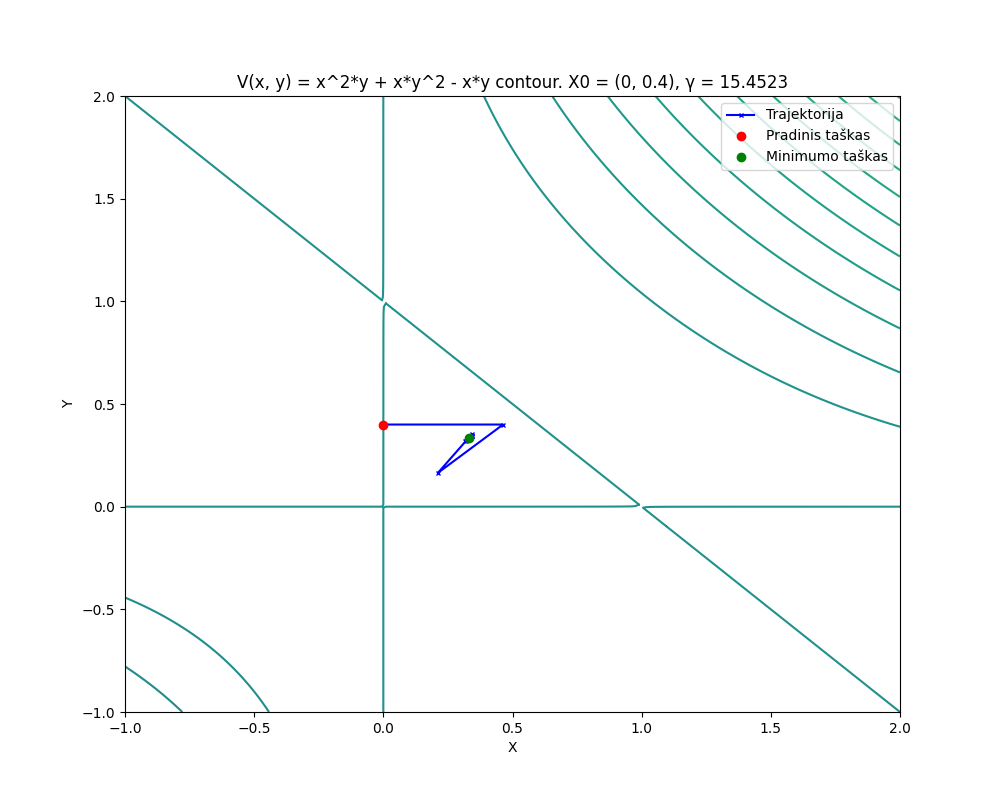

### Step 16.124, start (0, 0.4)

### Step 2.666, start (1, 1)

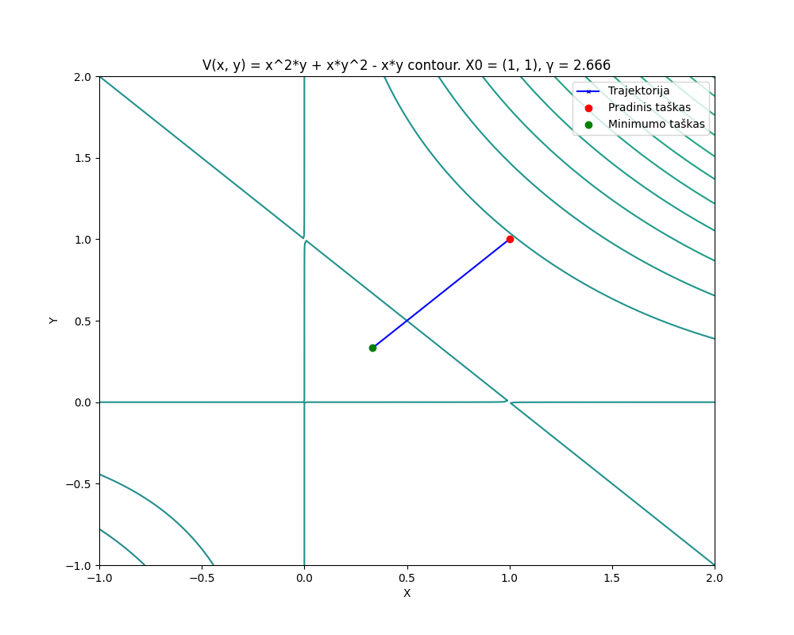

### Step 3.233, start (1, 1)

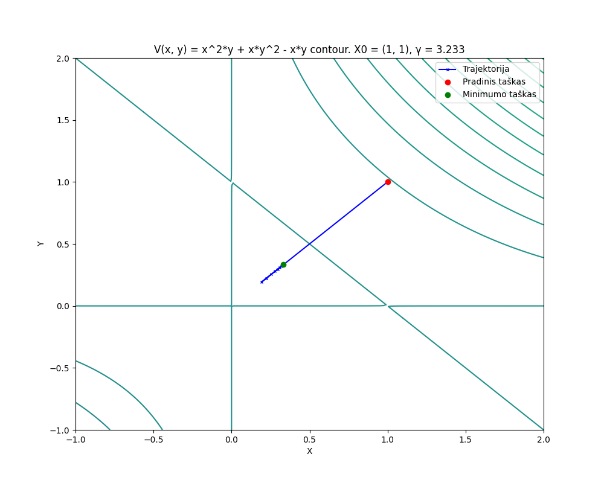

Four line-search experiments

### Search [0, 1], start (1, 1)

![Steepest descent with line search: start (1, 1), step-search interval [0, 1].](../assets/unconstrained-optimal-step-start-1-1-range-0-1.png)

### Search [0, 5], start (0, 0.4)

![Steepest descent with line search: start (0, 0.4), step-search interval [0, 5].](../assets/unconstrained-optimal-step-start-0-0.4-range-0-5.png)

### Search [0, 5], start (1, 1)

![Steepest descent with line search: start (1, 1), step-search interval [0, 5].](../assets/unconstrained-optimal-step-start-1-1-range-0-5.png)

### Search [5, 10], start (0, 0.4)

![Steepest descent with line search: start (0, 0.4), step-search interval [5, 10].](../assets/unconstrained-optimal-step-start-0-0.4-range-5-10.png)

Three deformable-simplex trajectories

### Simplex, start (0, 0.4)

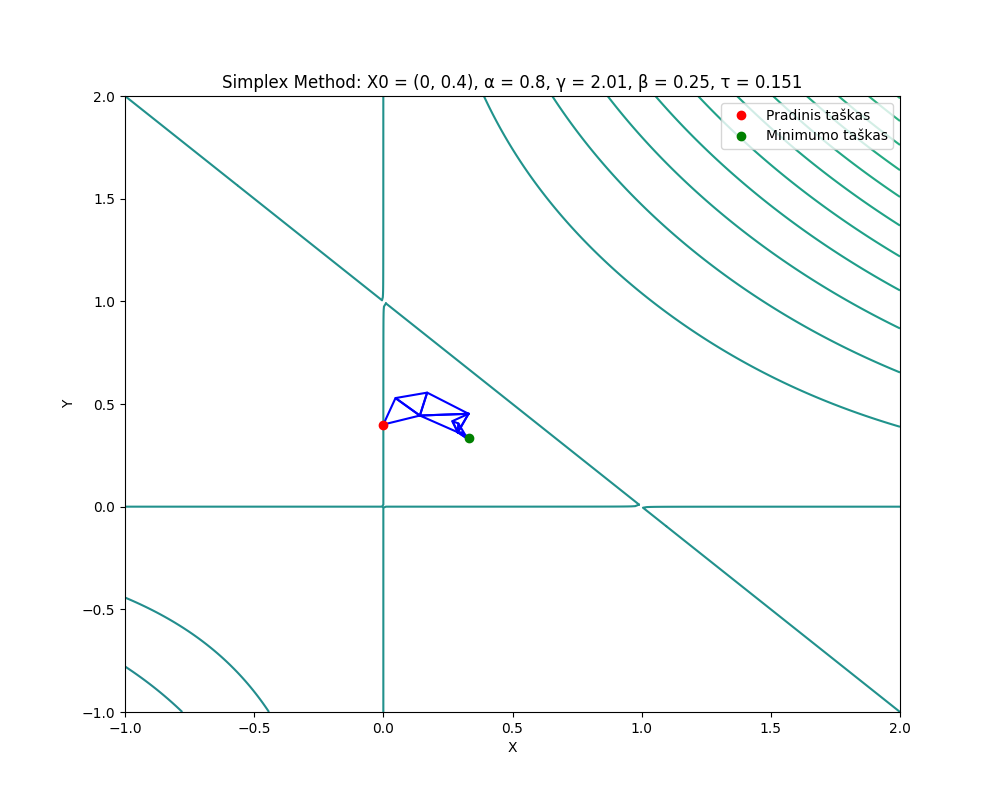

### Simplex, start (0, 0)

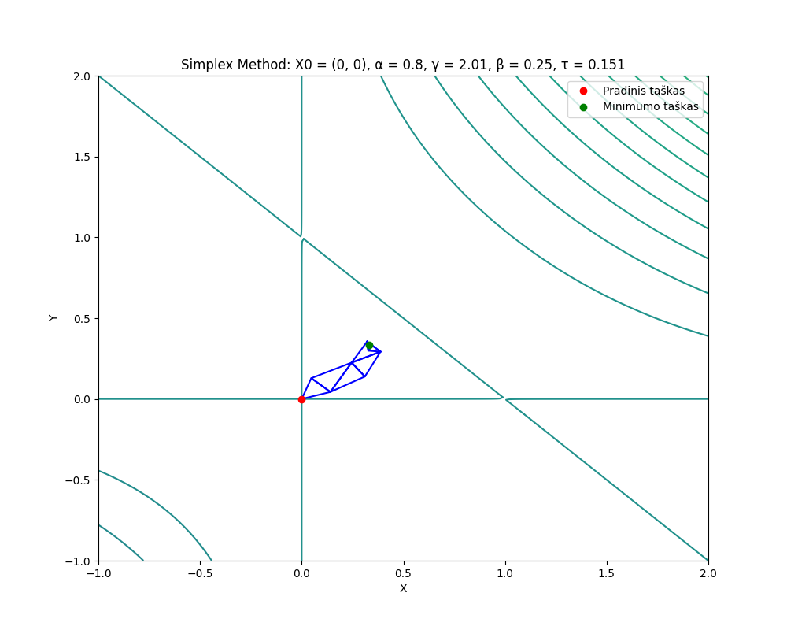

### Simplex, start (1, 1)

## Reports and provenance

The constrained box problem is documented through tables in its report. No original chart was found for that lab or for linear programming; no replacement chart is presented here.

See [recorded results](recorded-results.md), [report selection](../reports/README.md), and the [source manifest](provenance.json).
